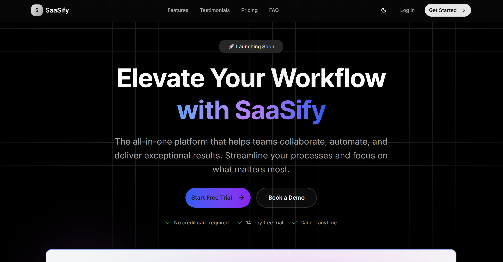

# SaaSly - Modern SaaS Landing Page

A beautiful, responsive SaaS landing page built with Next.js 15, React 19, and Tailwind CSS. Features modern design patterns, dark/light theme support, and smooth animations.

## 🌐 Live Demo

**[View Live Demo →](https://saasly-nextjs-landing.vercel.app/)**



## ✨ Features

- **Modern Design**: Clean, professional SaaS landing page design
- **Responsive Layout**: Fully responsive across all devices
- **Dark/Light Theme**: Built-in theme switching with next-themes
- **Smooth Animations**: Framer Motion powered animations and transitions
- **Component-Based**: Modular React components for easy customization
- **Performance Optimized**: Built with Next.js 15 and React 19 for optimal performance
- **Accessibility**: WCAG compliant with proper ARIA labels and semantic HTML

## 🚀 Sections

- **Hero Section**: Compelling headline and call-to-action
- **Features**: Product features showcase
- **How It Works**: Step-by-step process explanation
- **Testimonials**: Customer reviews and social proof
- **Pricing**: Transparent pricing plans
- **FAQ**: Frequently asked questions
- **Trust Logos**: Partner and customer logos
- **CTA Section**: Final conversion optimization
- **Footer**: Links and company information

## 🛠️ Tech Stack

- **Framework**: [Next.js 15](https://nextjs.org/) with App Router
- **React**: [React 19](https://react.dev/)
- **Styling**: [Tailwind CSS 4](https://tailwindcss.com/)
- **UI Components**: [Radix UI](https://www.radix-ui.com/)
- **Animations**: [Framer Motion](https://www.framer.com/motion/)
- **Theme**: [next-themes](https://github.com/pacocoursey/next-themes)
- **Icons**: [Lucide React](https://lucide.dev/)
- **Utilities**: [clsx](https://github.com/lukeed/clsx), [tailwind-merge](https://github.com/dcastil/tailwind-merge)

## 📦 Installation

1. **Clone the repository**
   ```bash
   git clone <your-repo-url>
   cd saasly-nextjs-landing
   ```

2. **Install dependencies**
   ```bash
   npm install
   # or
   yarn install
   # or
   pnpm install
   ```

3. **Run the development server**
   ```bash
   npm run dev
   # or
   yarn dev
   # or
   pnpm dev
   ```

4. **Open your browser**
   Navigate to [http://localhost:3000](http://localhost:3000)

## 🎯 Available Scripts

- `npm run dev` - Start development server with Turbopack
- `npm run build` - Build for production
- `npm run start` - Start production server
## 🏗️ Project Structure

```
saasly-nextjs-landing/
├── app/                    # Next.js App Router
│   ├── globals.css        # Global styles
│   ├── layout.js          # Root layout
│   └── page.js            # Home page
├── components/             # React components
│   ├── ui/                # Reusable UI components
│   ├── HeroSection.js     # Hero section component
│   ├── FeatureSection.js  # Features showcase
│   ├── Pricing.js         # Pricing plans
│   ├── Testimonials.js    # Customer reviews
│   └── ...                # Other sections
├── lib/                    # Utility functions
├── public/                 # Static assets
└── test/                   # Test files
```

## 🎨 Customization

### Colors and Themes
The project uses Tailwind CSS with a custom color palette. Modify `tailwind.config.js` to change colors and add custom design tokens.

### Components
Each section is a separate React component in the `components/` directory. Modify these files to customize content, layout, and styling.

### Content
Update the content in each component file to match your SaaS product:
- Hero section: Change headline, description, and CTA
- Features: Update feature descriptions and icons
- Pricing: Modify plans and pricing
- Testimonials: Replace with real customer feedback

## 📱 Responsive Design

The landing page is fully responsive and optimized for:
- Desktop (1024px+)
- Tablet (768px - 1023px)
- Mobile (320px - 767px)

## 🌙 Theme Support

The application includes built-in dark/light theme switching:
- Automatic theme detection based on system preferences
- Manual theme toggle in the navbar
- Persistent theme selection

## 🚀 Deployment

### Vercel (Recommended)
1. Push your code to GitHub
2. Connect your repository to [Vercel](https://vercel.com)
3. Deploy automatically on every push

### Other Platforms
- **Netlify**: Use `npm run build` and deploy the `out` directory
- **AWS Amplify**: Connect your repository and build with `npm run build`
- **Docker**: Create a Dockerfile and deploy to any container platform


## 📊 Performance

- **Lighthouse Score**: 90+ on all metrics
- **Core Web Vitals**: Optimized for LCP, FID, and CLS
- **Bundle Size**: Optimized with Next.js built-in optimizations
- **Image Optimization**: Automatic image optimization with Next.js Image component

## 🤝 Contributing

1. Fork the repository
2. Create a feature branch (`git checkout -b feature/amazing-feature`)
3. Commit your changes (`git commit -m 'Add amazing feature'`)
4. Push to the branch (`git push origin feature/amazing-feature`)
5. Open a Pull Request

## 📄 License

This project is licensed under the MIT License - see the [LICENSE](LICENSE) file for details.

## 🙏 Acknowledgments

- [Next.js](https://nextjs.org/) team for the amazing framework
- [Tailwind CSS](https://tailwindcss.com/) for the utility-first CSS framework
- [Radix UI](https://www.radix-ui.com/) for accessible UI components
- [Framer Motion](https://www.framer.com/motion/) for smooth animations

## 📞 Support

If you have any questions or need help:
- Create an issue in this repository
- Contact us at [pankajk07414@gmail.com](pankajk07414@gmail.com)
- Visit our website: [https://saasly-nextjs-landing.vercel.app/](https://saasly-nextjs-landing.vercel.app/)

---

**Built with ❤️ using Next.js and React**
